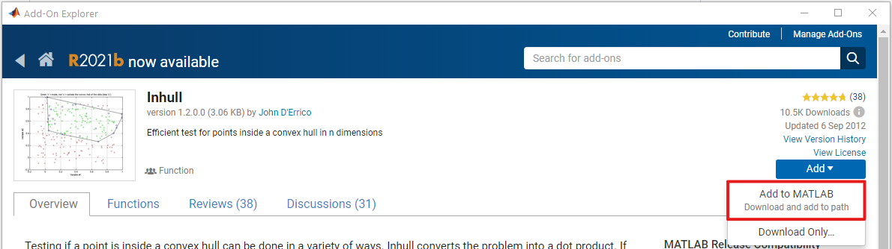

# LOVAMAP

## Overview

`LOVAMAP`

## System requirements

### Hardware requirements

No special hardware is required to run `LOVAMAP`. MATLAB's minimum hardware requirements, found [here](https://www.mathworks.com/support/requirements/matlab-system-requirements.html), should be sufficient for data sets of modest size.

### Operating system requirements

### Software dependencies

The following MATLAB add-ons are necessary:
- [Image Processing Toolbox](https://www.mathworks.com/help/images/)
- [Statistics and Machine Learning Toolbox](https://www.mathworks.com/help/stats/)
- [SLM - Shape Language Modeling](https://www.mathworks.com/matlabcentral/fileexchange/24443-slm-shape-language-modeling)
- [circlefit3d - fit circle to three points in 3d space](https://www.mathworks.com/matlabcentral/fileexchange/34792-circlefit3d-fit-circle-to-three-points-in-3d-space)
- [Inhull](https://www.mathworks.com/matlabcentral/fileexchange/10226-inhull)
- [Generate maximally perceptually-distinct colors](https://www.mathworks.com/matlabcentral/fileexchange/29702-generate-maximally-perceptually-distinct-colors)
- [GetFullPath](https://www.mathworks.com/matlabcentral/fileexchange/28249-getfullpath)

If you plan on using `LOVAMAP` on a Windows machine **and** do not already have a C++-14 compliant compiler, you will also need the following MATLAB add-on:
- [MATLAB Support for MinGW-w64 C/C++ compiler](https://www.mathworks.com/matlabcentral/fileexchange/52848-matlab-support-for-mingw-w64-c-c-compiler)

## Installation guide

### MATLAB add-ons

All of the add-ons listed above can be installed via MATLAB's add-on manager, which is accessible from MATLAB itself. The following are all released by MathWorks,
- [Image Processing Toolbox](https://www.mathworks.com/help/images/)
- [Statistics and Machine Learning Toolbox](https://www.mathworks.com/help/stats/) 
- [MATLAB Support for MinGW-w64 C/C++ compiler](https://www.mathworks.com/matlabcentral/fileexchange/52848-matlab-support-for-mingw-w64-c-c-compiler) (only applicable to Windows machines)

so there will only be the option to install them. MATLAB will probably restart during each of these installations.

For the following, which are not released by MathWorks, select the option 'Add to MATALB (download and add to path)':
- [SLM - Shape Language Modeling](https://www.mathworks.com/matlabcentral/fileexchange/24443-slm-shape-language-modeling)
- [circlefit3d - fit circle to three points in 3d space](https://www.mathworks.com/matlabcentral/fileexchange/34792-circlefit3d-fit-circle-to-three-points-in-3d-space)
- [Inhull](https://www.mathworks.com/matlabcentral/fileexchange/10226-inhull)
- [Generate maximally perceptually-distinct colors](https://www.mathworks.com/matlabcentral/fileexchange/29702-generate-maximally-perceptually-distinct-colors)
- [GetFullPath](https://www.mathworks.com/matlabcentral/fileexchange/28249-getfullpath)

### Compiling mex files

`LOVAMAP` relies on MEX files (located in `mex-lovamap`) that must be compiled first, which requires a C++-14 compliant compiler. Once that has been setup,

1. Navigate into the `mex-lovamap` directory in this repository.
2. Run the `compile_mex` script.
3. If successful, you should see `*.mex` file(s) appear in the `mex-lovamap` directory.

And you're done! Now, all methods that depend on C/C++ code are ready to go.

## Demo

`LOVAMAP` requires the following inputs in the order in which they are listed here.

| Input argument | Description |
|----------------|-------------|
| `domain_file`  | A `.csv` or `.json` file which describes the particle domain. |
| `voxel_size` | The size of each cubic voxel. The units of this parameter are assumed to be the same as the units used in the domain file. |
| `voxel_range` | The allowable range for the number of voxels to represent the domain. |
| `crop_percent` | |
| `hall_cutoff` | The maximum allowable diameter of a 'hallway' on the 2D-surface of the void space. The units of this parameter are assumed to be the same as the units used in the domain file. |
| `shell_thickness` | This defines the thickness of the shell of each particle which is measured from the edge of the particle inward. This region represents how far into each particle a biological cell can "reach" or sense ligand concentration. The units of this parameter are assumed to be the same as the units used in the domain file. |
| `num_2D_slices` | The number of evenly-spaced z-slices to sample from the domain for approximating the void _volume_ fraction, which is computed by averaging the void _area_ fraction of each z-slice. |

`LOVAMAP` returns the following outputs in the order in which they are listed here.

| Output argument | Description |
|-----------------|-------------|
| `data`    | A struct containing all of the data produced by `LOVAMAP` of the input particle domain. |
| 'time_log` | A struct array that logs the time spent in each section of `LOVAMAP`. This is mainly used as reference for debugging or testing new features. | 

## Instructions for use
